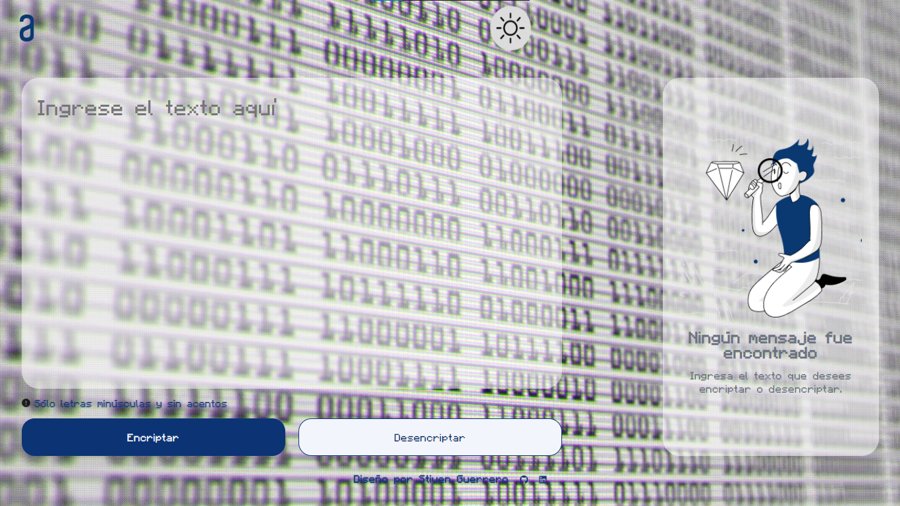
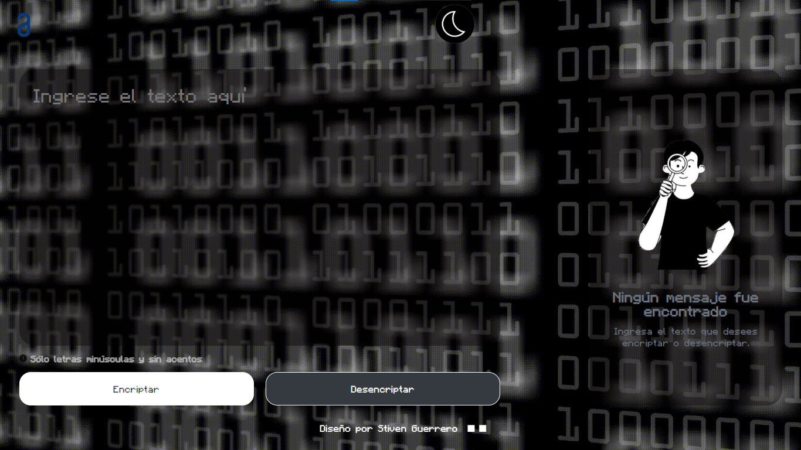
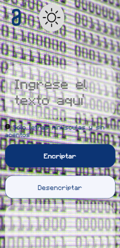
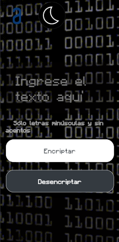

# ENCRIPTADOR_DE_TEXTO

***CHALLENGE ONE***

***Enlace:***
https://stivg18.github.io/Encriptador-de-Texto/

## **DESCRIPCION DEL PROYECTO**
Este proyecto es un challenge propuesto por Alura y Oracle Next Education

El proyecto se centra en desarrollar un programa en JavaScript que permita el cifrado de texto, añadiendo una capa adicional de seguridad, el proceso de cifrado implica generar una versión encriptada del texto proporcionado, la cual puede ser copiada y utilizada en el futuro, asegurando así la confidencialidad de la información.

El proyecto fue desarrollado en dos modos: light y dark. El modo light muestra una interfaz clara y brillante, mientras que el modo dark ofrece una apariencia más oscura y elegante.

#### ****Extra:****
El mensaje secreto ubicado en Trello es: 
***felicidades por enfrentar este desafio y haberlo concluido con exito***

## **DISEÑO PC**
***Light Mode***

******
***Dark Mode***

## **DISEÑO MOVIL**
  
